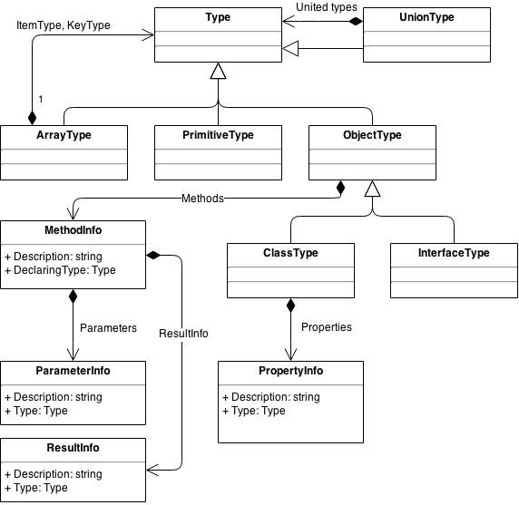

PHP Type Reflection
===================

This library provides classes to reflect php types in an unified way.

THIS LIBRARY IS STILL IN DEVELOPMENT and serves only as preview.
More documentation will be available on first real release.

Example Usage
-------------

``` php
<?php

namespace Hediet\Types\Test;

use Hediet\Types\Type;
use Hediet\Types\ArrayType;

interface FooInterface
{
    
}

class Foo implements FooInterface
{
    
}

abstract class MyClass
{

    /**
     * Does some stuff.
     * @param Type|MyClass|ArrayType $myArg Some input.
     * @return string[] The return value.
     */
    public abstract function myMethod($myArg);
}

$m = Type::ofObjectType("Hediet\Types\Test\MyClass")->getMethod("myMethod");

$this->assertEquals("Does some stuff.", $m->getDescription());
$this->assertEquals("The return value.", $m->getResultInfo()->getDescription());

/* @var $resultType ArrayType */
$resultType = $m->getResultInfo()->getType();
$this->assertEquals("string[]", $resultType->getName());
$this->assertEquals("string", $resultType->getItemType()->getName());
$this->assertTrue($resultType->isAssignableFromValue(array("str1", "str2")));
$this->assertFalse($resultType->isAssignableFromValue(array(1, 2)));

$this->assertFalse($resultType->isAssignableFrom(Type::ofMixed()));
$this->assertTrue(Type::ofMixed()->isAssignableFrom($resultType));

$myArgParam = $m->getParameters()[0];
$this->assertEquals("myArg", $myArgParam->getName());
$this->assertEquals("Some input.", $myArgParam->getDescription());
$this->assertEquals("Hediet\Types\Test\MyClass|Hediet\Types\Type", $myArgParam->getType()->getName());


//Union Types
$fooInterface = Type::of("Hediet\Types\Test\FooInterface");
$foo = Type::of("Hediet\Types\Test\Foo");
$fooOrFooInterface = Type::ofUnion(array($fooInterface, $foo));

$this->assertTrue($fooOrFooInterface->equals($fooInterface));
$this->assertTrue(
        Type::ofUnion(array($fooInterface, Type::ofBoolean()))
                ->isAssignableFrom($foo));

$this->assertTrue(
        Type::ofUnion(array($fooInterface, Type::ofBoolean()))
                ->isAssignableFrom(Type::ofBoolean()));

$this->assertFalse(
        Type::ofUnion(array($foo, Type::ofBoolean()))
                ->isAssignableFrom($fooInterface));

$this->assertFalse(
        Type::ofUnion(array($foo, Type::ofBoolean()))->isAssignableFrom(
                Type::ofUnion(array($foo, Type::ofBoolean(), Type::ofNull()))));

$this->assertTrue(
        Type::ofUnion(array($foo, Type::ofBoolean(), Type::ofNull()))->isAssignableFrom(
                Type::ofUnion(array(Type::ofBoolean(), $foo))));

?>
```

Class Diagram
-------------
